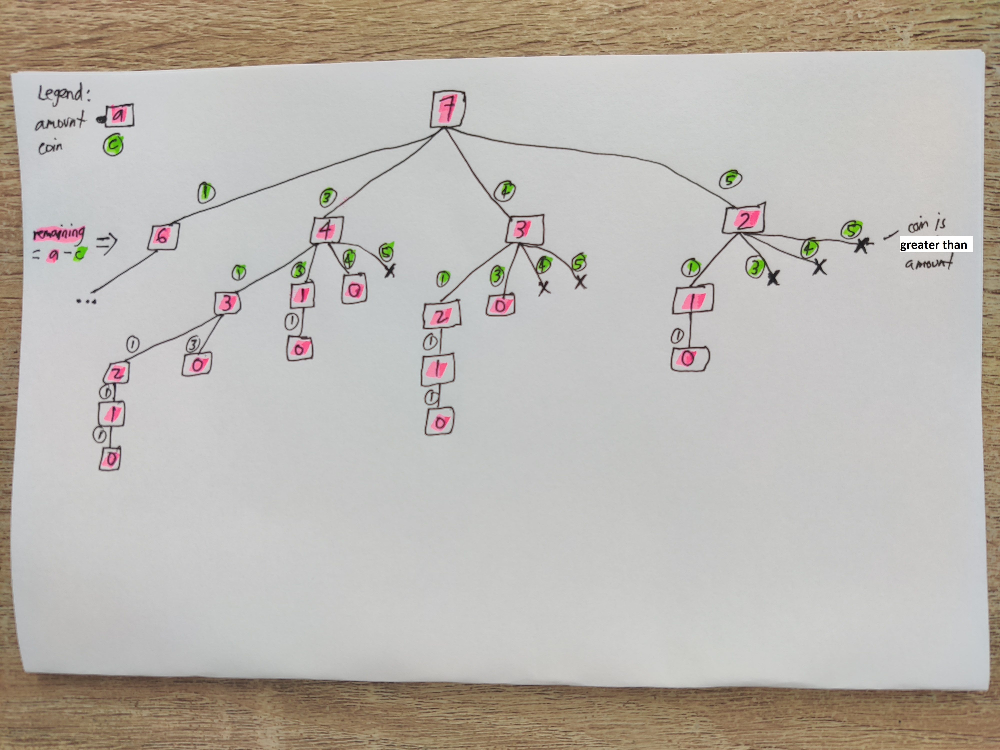
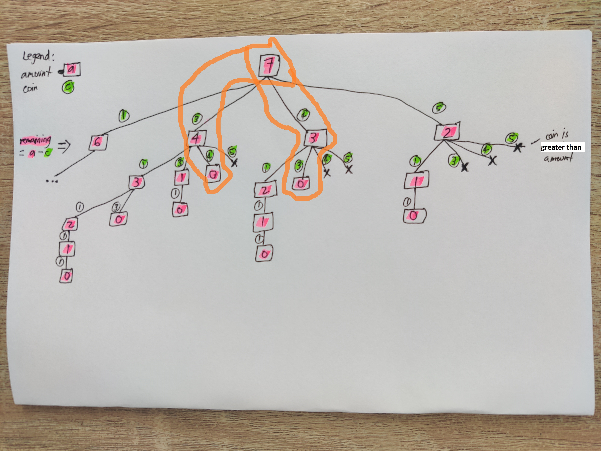
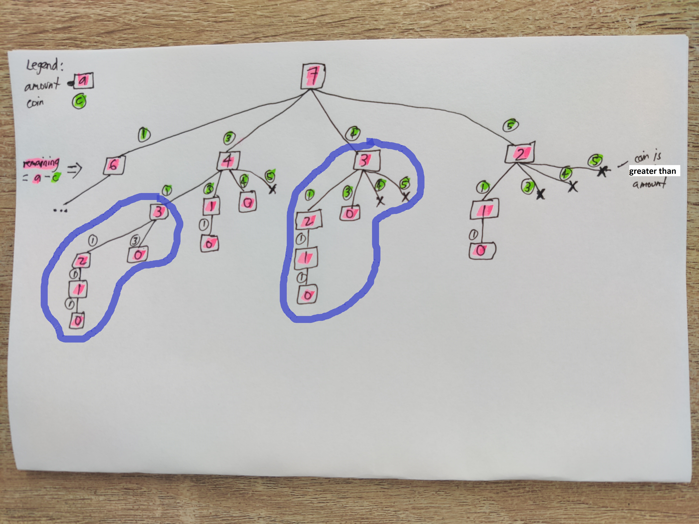

# [Coin Change](https://leetcode.com/problems/coin-change/)

Given a list of `coins` of different denominations and an `amount`, the task is to determine the least number of coins needed to make up the `amount`.

## Less optimal approaches

### The greedy solution: use the largest coin first

One might think the optimal way is to start using the biggest coins first since it gives us the best chance to use the least number of coins.

Say the amount is `11` and we have the following `coins`:

| 1 | 3 | 4 | 5 |
|---|---|---|---|

We can  first exhaust `5`-coins as much as possible until we can no longer use it. In this case, we can use it twice. That leaves us with `1` remaining (`11 - (5 + 5) = 1`) from the amount. We can't use the next biggest coin, `4`, to make up `1`. So we check `3` next, but we also can't use it. We move to `1`, which we can use once to make up the full amount. We end up using _3_ coins.

```java
5 + 5 + 1 = 11
```

That works with those set of coins. But what if we have an `amount` of `7` and have the same set of `coins`:

| 1 | 3 | 4 | 5 |
|---|---|---|---|

The said approach would generate a result of _3_, using `5` once and `1` twice:

```java
5 + 1 + 1 = 7
```

But we know just by looking at the coins that we can use fewer coins, _2_ to be exact, by using `3` and `4`.


### Using depth-first search

We can possibly fix the greedy solution by using DFS. Starting with a root node of `7` which is the `amount`, the goal is to break it down into subtrees by repeatedly subtracting each possible coin `c`, until the remaining amount becomes `0` (or `-1` if the `c` is greater than the remaining amount). With this, we can calculate the least number of coins to use.

Here's a sketch I created to help visualize the process better. We start at the top with an amount of `7`. Encircled and in green are the coins (`c`). Boxed in pink below them are the remaining amounts when the `c` is subtracted from the original amount in the parent node (`a`).



The answer to the problem would be the minimum number of subtrees that ends up in `0`. In this case that would be the ones where we used `3` and `4` (or vice versa):



Notice here that some subtrees actually have some overlap. For example, the two subtrees where `3` is the root end up being identical.



This means we can probably avoid repetitive calculations by reusing previous results. This is an indication that we can use dynamic programming to get the optimal result.

## Dynamic programming solution

The tree above shows that the problem can be divided into simpler subproblems, that in turn can be divided into much simpler subproblems. Moreover, we noticed that some of these subproblems can overlap. Thus, we can store the results of the subproblems and reuse them later to calculate bigger subproblems — a bottom-up approach.

To envision the subproblems we're tackling here, here's a definition (I hope I made it simple enough):


> For each integer `a` starting from `1` up to `amount`, calculate the minimum number of coins to be used in order to make up `a`.

We can use an array of integers with a size of `amount + 1` to store results. As the base case, we can initialize the result for `0` — the minimum coins to reach `0` is `0`.

```java
int minimumCoinCount[] = new int[amount + 1];
minimumCoinCount[0] = 0;
```

On to the main task. We need to identify the minimum number of coins needed for each `a` from `1` up to `amount`. How do we do this? Well, we can traverse each coin `c` and count the coins we will need if we use it using this simple formula:

```java
1 + minimumCoinCount[a - c]
```

`1` is for using one piece of coin `c`. Add that to the minimum coins needed to make up `a - c` (which was already calculated in previous iterations) and you get a potential count for `a`.

Question is, is it the minimum count? Well, we can simply initialize the minimum to be `amount + 1` and repeatedly replace this if we calculate a lesser count. Obviously, even if you only use `1`-coins to make up `amount`, it will still be less than `amount + 1`.

After all these calculations, we know that if `minimumCoinCount[amount]` is equal to `amount + 1` (the initial value), we did not find a way to use the `coins` we have to make up `amount`. So, we return `-1`.

But if `minimumCoinCount[amount]` is less than that initial value, then we know we figured out the most optimal count.

That's basically it. Looks complicated at first, but if you slowly dig into the sample solution — which I commented generously — I hope you'll realize it's pretty short and simple.
